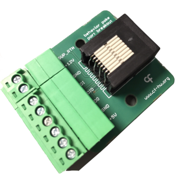

# Peripheral - Port Breakout

## General description

----

[//]: # (Tables can be generated using: https://www.tablesgenerator.com/markdown_tables)

## Hardware compatibility

| Peripheral HW Version 	| Board           	                                                | Board HW Version 	| Notes                            	|
|-----------------------	|-----------------	                                                |------------------	|----------------------------------	|
| **1.1**                   | [Device.Behavior](https://github.com/harp-tech/device.behavior) 	| > 1.2             |                                	|
| **2.x**                   | [Device.Behavior](https://github.com/harp-tech/device.behavior)   | > 2.0             | Can be powered with 3.3 or 5V 	|
|                       	|                 	                                                |                  	|                                  	|
----

## Key Features

* Makes available the ethernet ports pins in the Harp Behavior device
* Allows the control of a 12V valve (e.g. Lee LHD series)
* Screw terminals available for each pin 
* Allows the use of the Harp Behavior serial TX (3.3V or 5V) instead of the valve return pin (v2.x)

----

## Connectivity

* 1x Digital Input (DI)
* 1x Digital Input / Output (DIO) (can be used as the quadrature encoder output pin)
* 1x Digital Output (DO)
* 1x 5V supply (+5V)
* 1x 12V supply (+12V) (v1.1 only)
* 1x Supply return (compatible for +5V and +12V) (SUP_RTN) (v1.1 only)
* 1x Serial TX (v2.x only)

----

## Licensing

License files can be found, and are applied to, each individual subfolder in this repository.